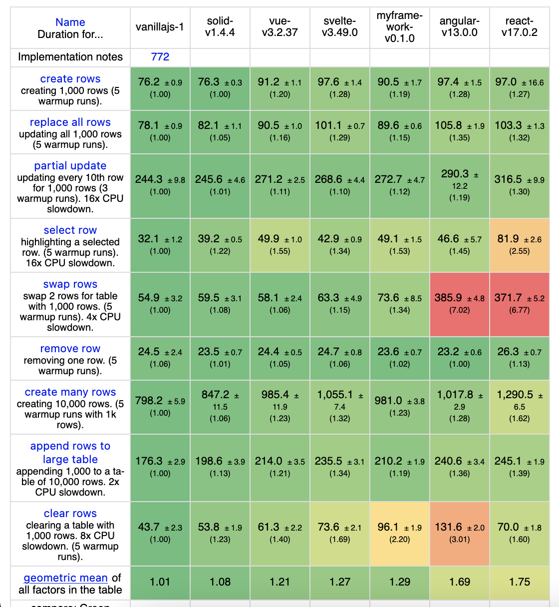
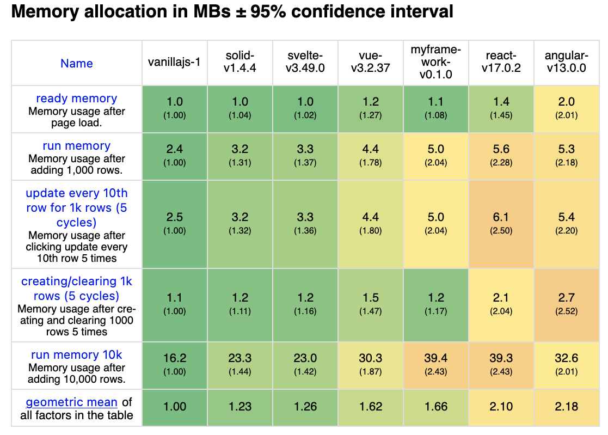

# javascript-framework

A Javascript UI framework for making reactive components without dom-diffing.

I made this because I wanted something like [SolidJS](https://github.com/solidjs/solid) that was just as fast
but without a compiler. However, there is already a similar [library](https://github.com/luwes/sinuous) so no future
updates will be made.

Use
===
You can learn how to use this framework here: [example.](example/example.js)

Performance
===
I used [this](https://github.com/krausest/js-framework-benchmark) package to benchmark this framework.
Here are some local [benchmarks](benchmarks.html) I ran with a few popular frameworks.

